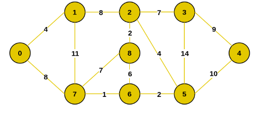

# Графы. Деревья

## Алгоритм Воршалла

Поиск транзитивного замыкания графа. Транзитивное замыкание графа - это булева матрица NxN, где на пересечении i-й строки и j-го столбца стоит 1, если существует нетривиальный путь между этими вершинами.

## Алгоритм Флойда (Флойда-Воршалла)

Поиск кратчайших путей между всеми парами вершин. Сложность O(V^3).

## Жадные алгоритмы

Жадный алгоритм — это алгоритм, который на каждом шагу делает локально наилучший выбор в надежде, что итоговое решение будет оптимальным.

## Система непересекающихся множеств (СНМ)

Структура данных, которая имеет всего две операции:
1. Union(x, y) - объединяет множество x и y.
2. Find(x) - возвращается представителя множества, где находится элемент x.

В нашем случае, алгоритм Крускала реализован на СНМ.

## Алгоритм Прима/Крускала

Поиск минимального остовного дерева.

Минимальное остновное - дерево, где все вершины соеденены между собой ребрами минимальной стоимости.

Граф, используемый в программе

