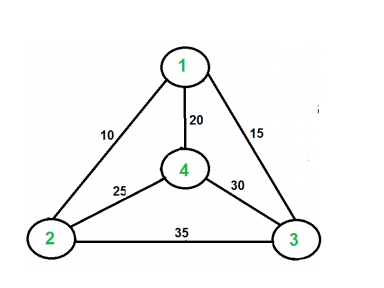

# Метод Грубой Силы

Метод грубой силы представляет собой прямой подход к решению задачи, обычно основанный непосредственно на формулировке задачи и определениях используемых ею концепций.

Пример: пузырьковая сортировка - алгоритм, который работает по принципу метода грубой силы (решение в лоб).

## Поиск выпуклой оболочки методом грубой силы

Для решения этой задачи, нужно знать следующее:

1. Углвые точки (вершины) оболочки
2. Каким образом соединены пары точек (X, Y)
3. Проверить каждый отрезок, соединяющий точки Pi и Pj множества, состоящего из n точек. Отрезок Pi, Pj является частью границы выпуклой оболочки тогда и только тогда, когда все прочие точки лежат по одну сторону от прямой, проходящей через эти две точки. Для того, чтобы проверить, лежат ли точки по одну сторону прямой, достаточно вычислить для них значения ax + by - c и выяснить, во всех ли точках эти значения имеют одинаковый знак. (a = y2 - y1; b = x1 - x2; c = x1y2 - y1x2)

## Исчерпывающий перебор

Исчерпывающий перебор представляет собой подход к комбинаторным задачам с позиции грубой силы. Он предполагает генерацию всех возможных элементов из области определения задачи, выбор тех из них, которые удовлетворяют ограничениям, накладываемым условием задачи, и последующий поиск нужного элемента.

## Задача коммивояжера

Надо найти такой кратчайший путь по заданным n городам, чтобы каждый город посещался только один раз и конечным пунктом оказался город, с которого начиналось путешествие. Краткая формулировка задачи: поиск кратчайшего гамильтонового цикла.

Гамильтоновым путём называется простой путь, проходящий через каждую вершину графа ровно один раз.

Гамильтоновым циклом называют замкнутый гамильтонов путь.

То есть для решения задачи нам надо смотреть все пути начиная с города s. Так как гамильтонов цикл точно существует, то значит из города s мы можем посетить любой город.
Для нахождения минимального гамильтонового пути, надо просто перебрать всевозможные пути. Сложность будет O(n!).

Граф, используемый в решении задачи

## Решение задачи о рюкзаке методом исчерпывающего перебора

Задача о рюкзаке решается полным перебором всевозможных способов поместить предметы в рюкза (МГС). Сложность будет O(2^n) (включен/не включен элемент в множество)

## Решение задачи о назначениях методом исчерпывающего перебора

Дано n сотрудников и n задач, каждая из которых стоит wi времени. Каждый сотрудник может выполнить задачу с определенной стоимостью. Нужно определить наименьшую стоимость решения всех задач. Данну задачу можно решить через МГС полным перебором.