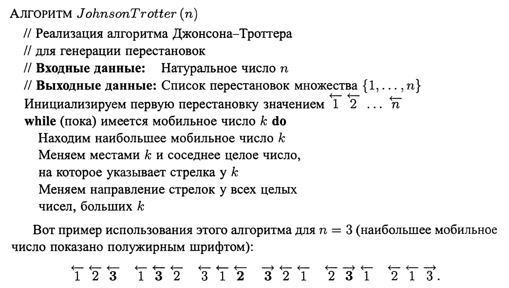

# Разное

## Умножение больших чисел

Для работы с большими числами, которые нельзя разместить в переменной примитивного типа, можно создать свой класс BigInteger. Два целых числа можно представить в виде строк и ввести операции сложения, вычитания и умножения. С другой стороны, можно представить два целых чисел в виде битовых векторов и также ввести основные арифметический операции (способ на битовом векторе более сложный). В таких языках как C# и Java класс для работы с большими числами называется BigInteger и реализован на битовом векторе.

## Бинарный поиск

Бинарный поиск - это алгоритм для быстрого поиска в отсортированной коллекции (массиве). Работает бинарный поиск за O(log(n)), где n - количество элементов коллекции.

## Поиск пары ближайших точек методом декомпозиции

Аналогично сортировке слиянием, мы можем найти минимальное расстояние между двумя точками. Условие: коллекция точек должны быть отсортированной.

## Поиск выпуклой оболочки методом декомпозиции

В данном алгоритме мы должны для начала отсортировать коллекцию точек. Далее мы методом декомпозиции должны построить две части выпуклой оболчки и соеденить их. Сложность алгоритма O(nlog(n)). Более подробно https://ru.wikipedia.org/wiki/Алгоритм_Киркпатрика

## Метод уменьшения размера задачи

Метод уменьшения размера задачи ("уменьшай и властвуй") основан на использовании связи между решением данного экземпляра задачи и решением меньшего экземпляра задачи той же задачи. Если такая связь установлена, ее можно использовать либо сверху вниз (рекурсивно), либо снизу вверх (без использования рекурсии). Имеется три основных варианта метода уменьшения размера:
1. уменьшение на постоянную величину
2. уменьшение на постоянный множитель
3. уменьшение переменного размера

## Генерация перестановок. Алгоритм Джонсона-Троттера

Для генерации перестановок вводится понятие мобильного числа. Мобильное число - это число, стрелка над которым по своему направлению указывает на меньшее число.
Реализация алгоритма:
1. Находим мобильное число k  и меняем местами k и соседнее целое число, на которое указывает стрелка у k.
2. Меняем направления стрелок у всех целых чисел, больших k.
3. Повторяем до тех пор, пока имеется мобильное число.

