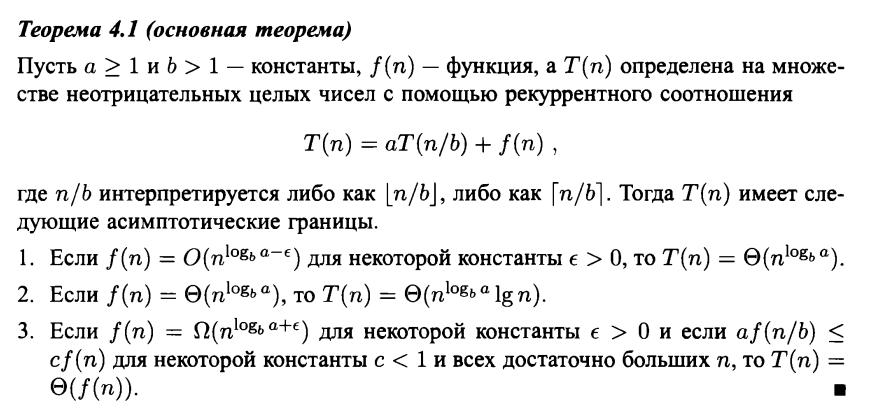

# Временная и пространственная эффективность алгоритма
Для анализа временной сложности алгоритма мы можем ввести функцию T(n), которая будет показывать
за какое время работает алгоритм от входных данных n.

Для анализа пространственной сложности алгоритма мы можем ввести функцию V(N), которая будет
показывать какое дополнительное количество памяти нужно для работы алгоритма.

## Основные функции, которые показывают временную сложность алгоритма

| Факториальная | O(n!) |
| Экспоненциальная | O(2^n) |
| Логарифмическая | O(log(n)) |
| Линейная | O(n) | 
| Квадратная | O(n^2) |
| Кубическая | O(n^3) |
| Константная | O(1) |

Время работы алгоритма в наихудшем случае - это верхний предел этой величины для любых входных данных.

Среднее время работы алгоритма - это его математическое ожидание.

Наилучшее время работы алгоритма - это наилучшее возможное время работы алгоритма, при условии, что будут подобраны хорошие входные данные.

## Метод декомпозиции 

Парадигма, лежащая в основе метода декомпозиции "разделяй и властвуй", на каждом уровне рекурсии включает в себя три шага.

1. Разделение задачи на несколько подзадач, которые представляют собой меньшие экземпляры той же задачи.
2. Властвование над подзадачами путем их рекурсивного решения. Если размеры подзадач достаточно малы, такие подзадачи могут решаться непосредственно.
3. Комбинирование решений подзадач в решение исходной задачи.

С помощью метода декомпозиции реализованы алгоритмы быстрой сортировки и сортировки слиянием.

## Мастер теорема (для рекуррентных соотношений)

